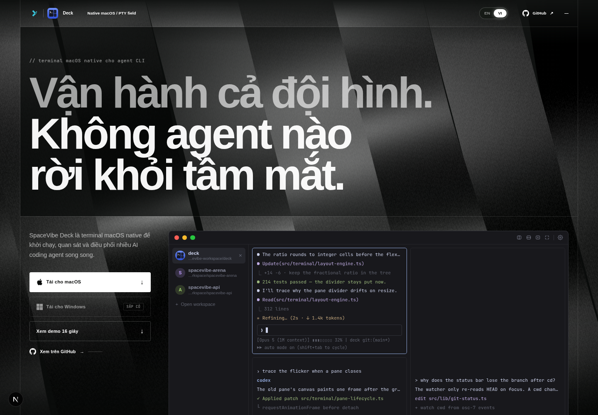

# Study Manager

[](https://nextjs.org/)
[](https://www.typescriptlang.org/)
[](LICENSE)

Study Manager is the repository for a responsive SpaceVibe Deck landing-page
experience. The site presents a native macOS terminal for launching, monitoring,
and steering multiple AI coding agents through an editorial, motion-rich product
story.

The application uses Next.js as a lightweight host for a self-contained landing
experience. It includes the production page, local media, responsive layouts,
locale controls, video playback, and the original scroll-driven interactions.



## Highlights

- Responsive desktop and mobile presentation
- Full-screen hero and live terminal preview
- Product demo reel with local poster and video assets
- Sticky, scroll-driven feature tour
- Agent grid, focus, and board presentation states
- Localized interface controls
- Production metadata and analytics gating
- Static assets served locally from `public/`

## Technology

- [Next.js 16](https://nextjs.org/) with the App Router
- [React 19](https://react.dev/)
- [TypeScript](https://www.typescriptlang.org/) in strict mode
- [Tailwind CSS 4](https://tailwindcss.com/)
- ESLint and Next.js production build checks

## Requirements

- Node.js 24 or newer
- npm (included with Node.js)

## Getting started

Clone the repository and install its dependencies:

```bash
git clone https://github.com/DevOpsLogistics/Study-manager.git
cd Study-manager
npm install
```

Start the local development server:

```bash
npm run dev
```

Open [http://localhost:3000](http://localhost:3000) in a browser.

## Available commands

| Command | Purpose |
| --- | --- |
| `npm run dev` | Start the development server |
| `npm run build` | Create an optimized production build |
| `npm run start` | Serve the production build |
| `npm run lint` | Run ESLint |
| `npm run typecheck` | Check TypeScript without emitting files |
| `npm run check` | Run lint, type checking, and a production build |

Before opening a pull request or publishing a deployment, run:

```bash
npm run check
```

## Project structure

```text
src/
  app/                       Next.js layout, page, and global styles
  components/                Application components
public/
  assets/                    Bundled application assets
  landing-prototype/         Self-contained landing experience
  deck-tour-poster.png       Demo video poster
  deck-tour.mp4              MP4 demo video
  deck-tour.webm             WebM demo video
docs/
  design-references/         Desktop and mobile reference images
  research/                  Design, behavior, and component notes
```

The root Next.js page renders `DeckExperience`, which embeds
`/landing-prototype/index.html` in a viewport-sized frame. Keeping the landing
document isolated preserves its canvas lifecycle, locale state, media controls,
and scroll calculations.

## Deployment

The project can be deployed to any service that supports Node.js and Next.js.
For a standard production deployment:

```bash
npm install
npm run build
npm run start
```

When deploying behind a platform such as Vercel, use the repository defaults;
the framework and build command are detected automatically.

## Contributing

1. Create a branch from `master`.
2. Make a focused change.
3. Run `npm run check`.
4. Commit the change with a clear message.
5. Open a pull request describing the behavior and visual impact.

Do not commit secrets, local environment files, dependency directories, or
generated `.next` output.

## License and attribution

This repository is released under the [MIT License](LICENSE).

The project was bootstrapped from the
[AI Website Cloner Template](https://github.com/JCodesMore/ai-website-cloner-template),
which is also distributed under the MIT License. Its original copyright notice
is retained in this repository's license file.

Product names, logos, screenshots, media, and other third-party brand assets may
remain the property of their respective owners. The MIT License applies to the
software in this repository and does not grant trademark rights.
